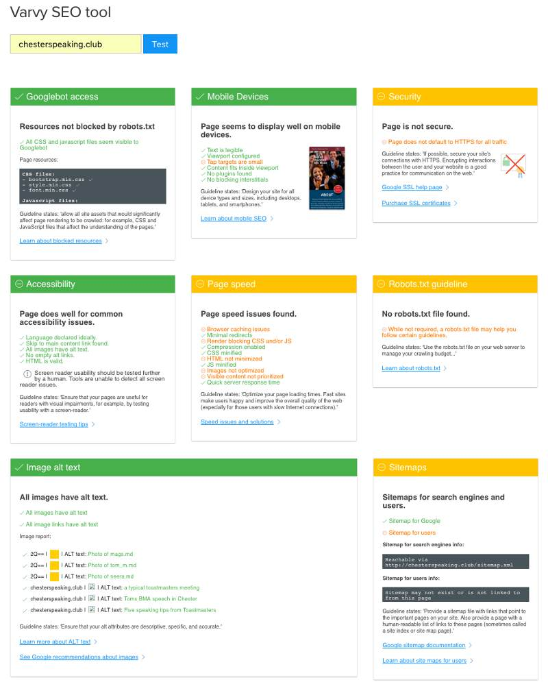
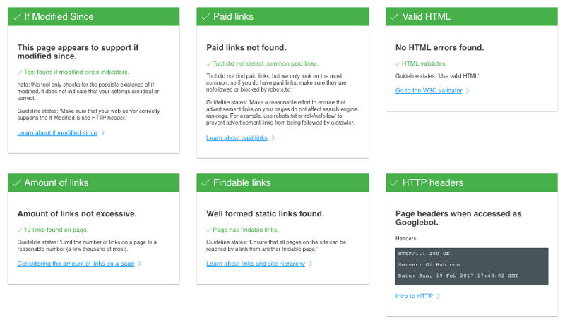

# Search Engine Optimisation (SEO)
Here is some SEO of my Chester Speaking Club site using chrome dev tool’s PageSpeed and the [Varvy](https://varvy.com) SEO tool.

In addition to PageSpeed the Varvy tool identified the need to switch to all HTTPS, the use of Sitemaps and robots.txt on the site as well as the tap area when in mobile usage being a little too small.

